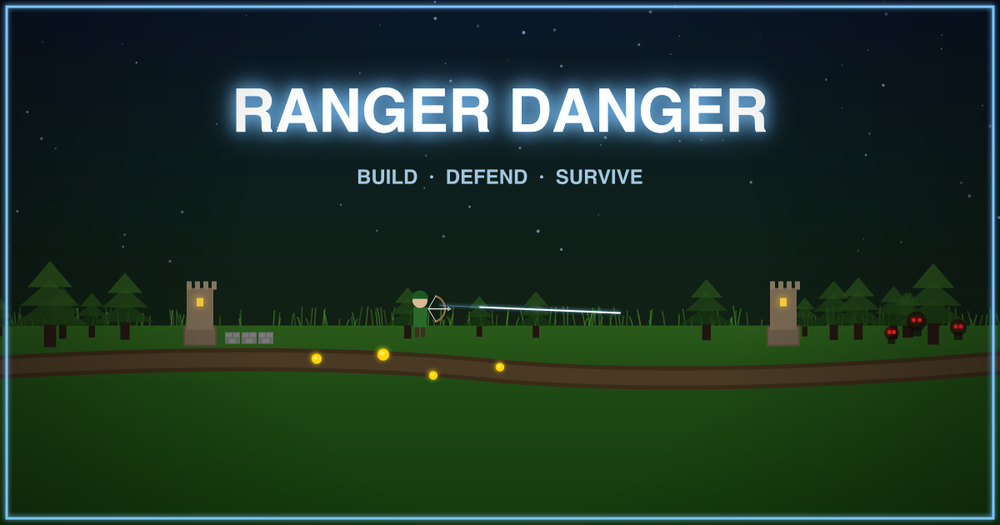

# Ranger Danger

A top-down 2D tower defense / action hybrid built with **Phaser 3 + TypeScript + Vite**. Most pixel art is procedurally generated in code; the level select map and a few tower bases are external sprites.

**Play it live:** https://rangerdanger.xyz

## Gameplay

- Survive waves of enemies across multiple biomes.
- Build arrow towers, cannon towers (with splash damage), and walls to funnel and kill enemies.
- Towers auto-target the nearest enemy in range; enemies path toward the player.
- Between waves, a build break timer lets you reposition defenses.
- After clearing the wave bar, a boss spawns — defeat it to earn a medal and unlock the next level.
- Selling a wall or tower starts a 3s red-pie countdown so you can't yank a structure out from under enemies mid-attack. Bosses can blow through both walls and towers — keep an eye on HP bars.

## Up Next

Roadmap items, in no particular order:

- **Pixel art overhaul** — spend more time on AI pixel sprite page generators to lift the overall art quality.
- **Persistent storage** — move progress off `localStorage` so clearing the cache doesn't wipe medals / unlocks.
- **Co-Op Mode** — more enemies, shared gold, more excitement.
- **Menu / Settings screen** — volume, controls, accessibility, save management.
- **Build out remaining biomes** with new enemy styles and attacks; more variety needed in enemies overall.
- **Boss variety and attacks** — more attack patterns and unique mechanics per biome.
- **Character upgrades** — spend coins to upgrade movement speed, attack speed, attack power.
- **Player experience levels** — unlock upgrades as you play more. Gauge how the player did on a specific level and award XP for that plus convert any remaining coins to XP.
- **Multiple characters** — different heroes besides Ranger, each with stat upgrades. Examples: −10% tower price for Engineer, +10% attack speed for Ranger, etc.
- **Leaderboard** — score-based ranking per level per difficulty.
- **QoL updates** — ongoing UX polish.
